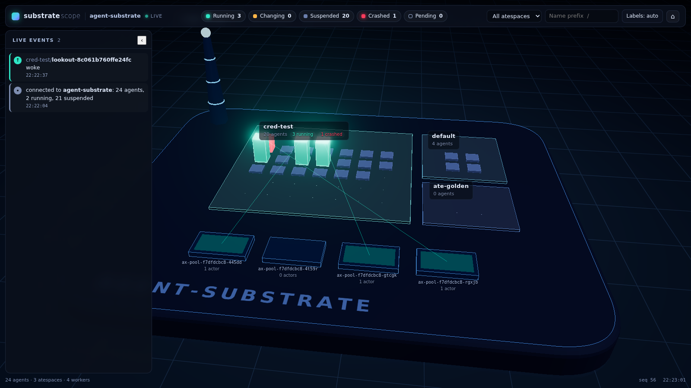
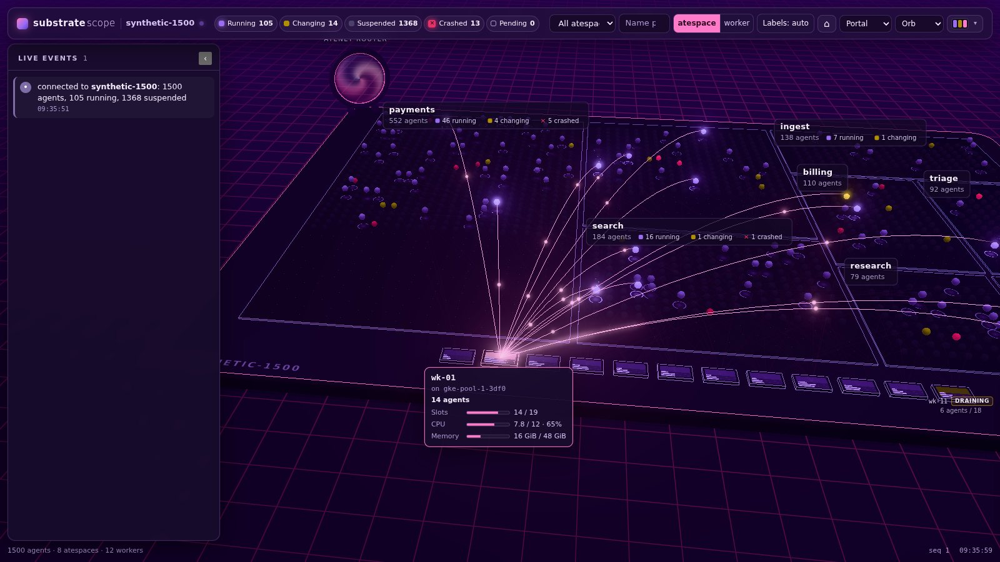
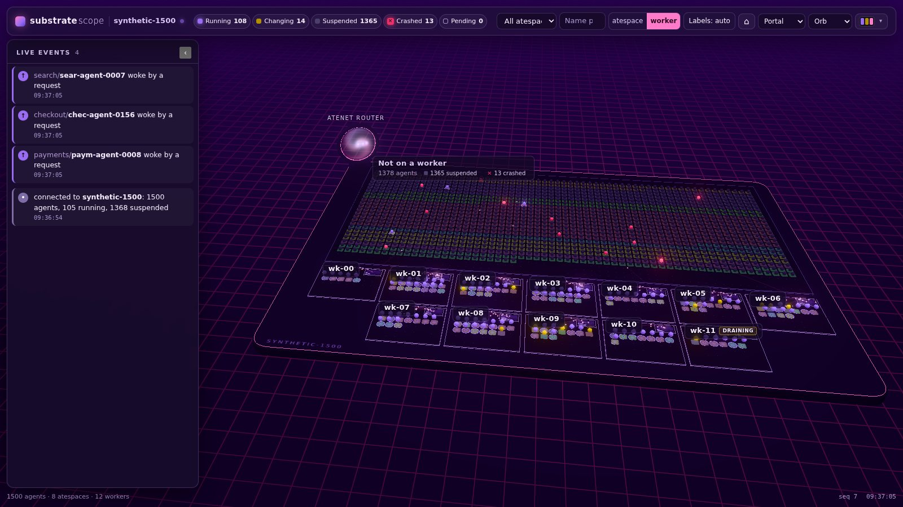
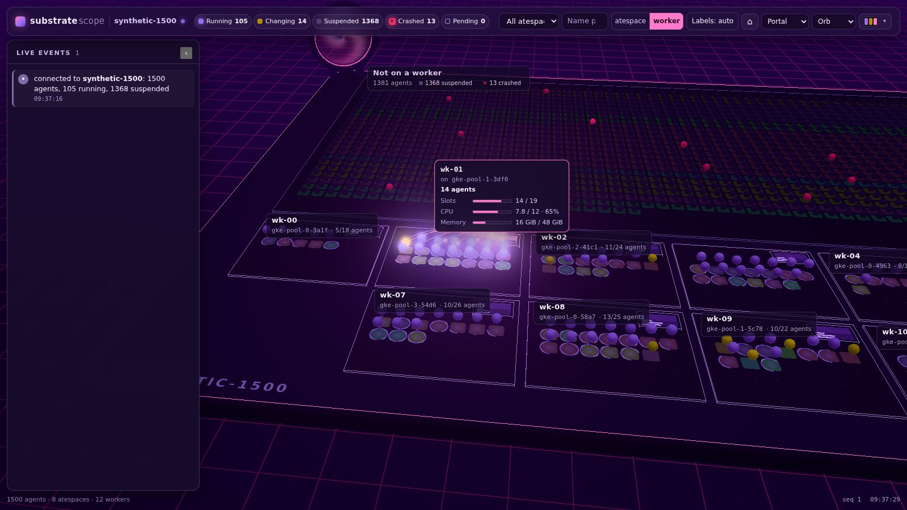
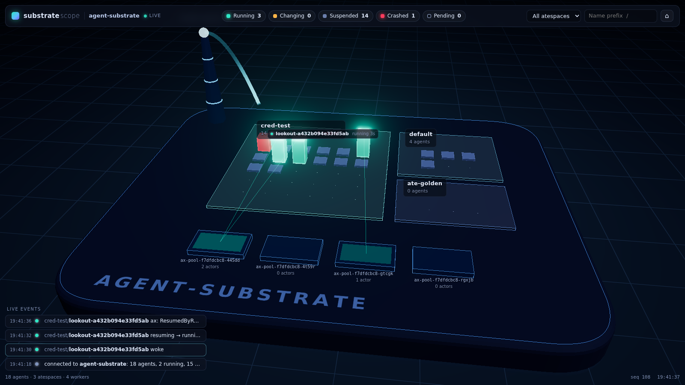
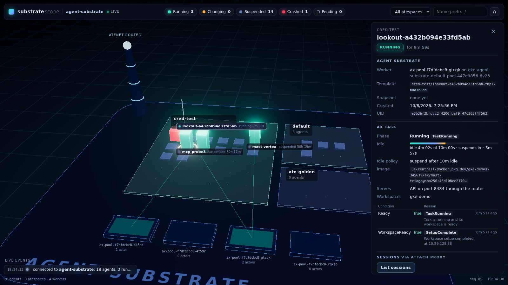
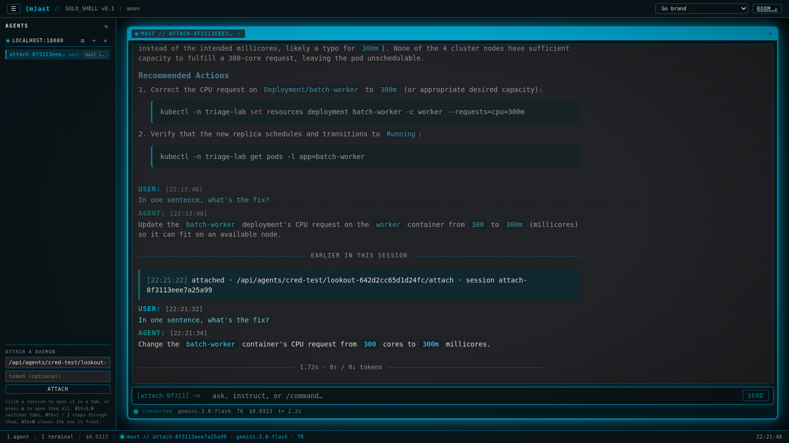

# substrate-scope

A live 3D view of every agent on [Agent Substrate](https://github.com/agent-substrate/substrate): which agents are running, which are suspended, which just woke up or crashed, per cluster and per atespace. Agents that are [Agent Executor (ax)](https://github.com/google/ax) tasks show what ax knows too (phase, why they were suspended, idle time), and agents that serve a session API (mast, core-agent) can be opened right from the view.

Rendered with three.js, GPU instancing and semantic zoom (district heat tiles far away, one point per agent in between, full shapes up close) so a cluster with 100,000 agents and 2,000 workers stays interactive. A small Go collector per cluster polls Substrate and ax, never wakes a suspended agent, and pushes changes to the browser.



**Status:** milestone 1 (live view of one cluster) and the rendering half of milestone 2 (scale). See [docs/design.md](docs/design.md) for the design and what comes next.

## What you see

- The **island** is the cluster. Each **district** is an atespace, sized by how many agents it holds.
- Each **agent** is a column. Running agents stand tall and glow teal, suspended ones lie flat and dim, agents changing state are amber, crashed ones pulse red, and agents with no state yet are drawn as outlines.
- **Events** play as short animations: an arc from the router tower when a request wakes an agent, a ripple when an agent is suspended, a red shockwave when one crashes, a beam of light when a new task appears.
- In the combined layout, **worker pads** line the front of the island, each with a fill bar for its actor slots (and CPU and memory when the worker reports them). A faint arc with small flowing dots connects each agent that holds a worker to it; busier agents send more and faster dots.
- **Which agents run where:** hover or click a worker pad and its agents light up (the rest recede), its arcs brighten, and the pad shows a card with the worker's node, agents, and slots/CPU/memory used. Hover or select an agent and its worker lights up, with a subtle highlight on its siblings; the side panel's **show worker** pins the worker and flies to it. Esc or a click on empty space clears it.
- **Two decks** (the default layout): agents on a glassy top deck, workers on a deck of their own below (node pool, node, worker), and a thin beam of light from each running agent down to its worker; a wake drops a beam, a suspend retracts it. Zoomed out, beams merge into flow ribbons from each atespace to each node pool, sized by the agents on that pair. `1`, `2` and `3` show the agent deck, the worker deck or both. **Layout: decks | combined** in the header (or `?layout=combined`; remembered) switches to the single island below.
- **Controls tour**: the **?** button (bottom right), the `?` key or `?demo=controls` plays a captioned walkthrough of every way to move around (orbit, pan, zoom, moving and raising the decks, linking, fades, select, pin, beams, layout, reset), performed on the live scene with a ghost cursor and key caps; Space pauses, ←/→ step, Esc ends it and puts your view back.
- **Group by worker** (combined layout): the **Group: atespace | worker** toggle in the header (or `g`, or `?group=worker`; remembered) re-flows the island so each worker is a platform holding its agents, with agents that hold no worker (suspended, pending) parked behind them. Each agent stands on a tile tinted by its atespace, so "which team runs here" is still answerable. Agents glide between the layouts.
- Click an agent for the **side panel**: Substrate state, worker, template, snapshot; ax phase, conditions and reasons (`IdleSuspended`, `ResumedByRequest`, ...), the idle policy and, for running ax tasks, the live idle time. With the attach proxy configured you can list the agent's sessions and **open the agent in [mast-web](https://github.com/go-steer/mast-web)**, a full attach client: read the transcript, send messages, start sessions, interrupt, approve or deny parked actions. A suspended agent gets a **Wake** button that asks first.
- **Live events** sit in a panel on the left (newest on top, colored by kind; click one to fly to its agent). `e` or the ‹ button collapses it to a tab; the choice is remembered.
- **Labels** stay quiet: only the selected agent, agents that just changed state (for a few seconds) and, when you zoom in close, the agents around you. Hover an agent for a tooltip. The **Labels** button (or `l`) switches between auto, all and off.
- **Filters** (atespace, state chips, name prefix) dim everything that doesn't match. `/` focuses the search, Enter flies to the first match, `h` shows the whole island, Esc closes the panel. `?synthetic=5000` replaces the collector with 5,000 generated agents, for looking at the scene at scale; `&workers=2000` adds a fleet in node pools and `&churn=N` sets state changes per second (default 1% of agents per second from 10,000 agents up).
- **Big clusters** zoom semantically: far away each atespace (in worker view each node pool) is one tile showing its agents' mix of states, closer each agent is a point sprite, and up close the nearest 5,000 agents are full shapes. `?perf=1` (or `p`) shows frame times, draw calls and instance counts; its Benchmark button (or `?bench=1`) flies a fixed 20 s path and copies a summary to paste. See [Scale](docs/design.md#scale).
- **Themes**: eight themes (four dark, four light) from the picker at the right of the header, or `?theme=<id>` (`orchid-night`, `abyss-neon`, `volt-noir`, `cotton-candy`, `riso-paper`, `glacier`, `google-light`, `google-dark`). The choice is remembered; `?tour=1` cycles through them every 8 seconds. Every color, light and glow value lives in `web/js/themes.js`.

| Hovering a worker pad | Grouped by worker | A worker pinned in worker view |
|---|---|---|
|  |  |  |

| A request wakes a suspended agent | The side panel: ax reasons and live idle time | A lookout incident in mast-web, opened from the panel |
|---|---|---|
|  |  |  |

## Quickstart (in a cluster)

Requires Agent Substrate **v0.4.0** (the collector is built against it). The collector runs as its own service account in namespace `substrate-scope`. It authenticates to Substrate's control API with a projected token for audience `api.ate-system.svc` and trusts the servicedns CA bundle, the same way ax-server does.

If Substrate's API server runs with authorization enforced (`--experimental-enable-authz`), grant the collector the **global viewer** role: an entry `user:system:serviceaccount:substrate-scope:substrate-scope` under role `viewer` in the global access policy, created or updated by one of the `--authz-bootstrap-owners`. Without it, listing atespaces and actors fails with PermissionDenied. See [Authorization](docs/design.md#authorization) for which calls are checked and a grpcurl example.

```sh
kubectl apply -f deploy/substrate-scope.yaml
kubectl -n substrate-scope port-forward svc/substrate-scope 8080:80
# open http://localhost:8080
```

Optional: let the UI open agents' sessions. Create a Secret with the bearer token the agents expect on their session API; the collector adds it, plus the router's `ate-target-actor` header, to requests through `/api/agents/{atespace}/{name}/attach/...`.

```sh
kubectl -n substrate-scope create secret generic substrate-scope-attach --from-file=token=PATH_TO_TOKEN
kubectl -n substrate-scope rollout restart deploy/substrate-scope
```

With the attach proxy on, the collector also serves a vendored copy of mast-web at `/mast-web/a/{atespace}/{name}/`, attached to that one agent (see [Sessions in mast-web](#sessions-in-mast-web)).

Flags (see `substrate-scope -h`): `--cluster` (name on the island), `--substrate-*` (endpoint, authority, token and CA files), `--ax-endpoint` (empty disables ax), `--router` (empty disables runner status and attach), `--attach-token-file`, and the poll intervals (`--actor-interval=2s`, `--worker-interval=10s`, `--task-interval=10s`).

## Never waking an agent

Looking must not change what you look at, so the collector:

- calls only Substrate's list and get RPCs and ax's `ListTasks`, which are answered from those services' own stores and never reach an actor. A test (`internal/substrate/nevermutate_test.go`) fails if any code refers to a mutating Substrate or ax RPC (including v0.4's access policy writes, so the collector can never grant itself access);
- reads an ax runner's status (`/metadata/v1alpha1/ax/status`, through the router) only for the agent selected in the UI, only if Substrate reports it `RUNNING`, and re-checks that with `GetActor` right before, because the router resumes a suspended actor to deliver any request;
- refuses attach requests to an agent that isn't running unless the request says it may wake it (`scope_wake=1`). The UI asks first and says so.

Requests through ax's pass-through (listing sessions, an open mast-web session) count as activity for ax's idle timer, so opening a running agent's sessions postpones its idle suspension, and an open mast-web session keeps it awake.

## Sessions in mast-web

"Open in mast-web" opens a new tab at `/mast-web/a/{atespace}/{name}/`. That is [mast-web](https://github.com/go-steer/mast-web), unchanged, vendored in `web/vendor/mast-web/` (version in its `VERSION` file, license alongside; `make vendor-mast-web MAST_WEB_REF=<ref>` refreshes it).

mast-web starts by asking `GET /config` what deployment it is in. The collector answers in mast-web's "proxy" mode with `api_prefix` set to the agent's attach proxy, `/api/agents/{atespace}/{name}/attach`, so mast-web skips its setup form and talks to exactly that agent. mast-web asks for `/config` at the origin root, so the collector tells agents apart by the request's `Referer` (the mast-web page, always same-origin; the pages are served with `Referrer-Policy: same-origin`). `/mast-web/a/{atespace}/{name}/config` answers the same for clients that ask relative to the page.

The agent's bearer token never reaches the browser: the attach proxy adds it. That also means **everyone using the UI acts as the agent's operator**, with one shared identity; the panel says so. The proxy still refuses to wake a suspended agent unless the request carries the wake consent, which only the panel's Wake button sends, so a mast-web tab left open on an agent that has since suspended gets a 409 instead of waking it.

mast lists only the sessions it holds in memory. A woken agent starts with none, and a session comes back when it is used again.

## Development

```sh
make test          # Go and JS unit tests
make ci            # gofmt/goimports, vet, tests, JS syntax check + ESLint (npm ci first)
make run-local     # run the collector on your machine against $CONTEXT, serving web/ from disk
make push deploy   # build, push to IMAGE, pin the digest in deploy/, apply
```

`dev/run-local` port-forwards Substrate's API server, ax-server and the router, mints a short-lived token for the `substrate-scope` service account and fetches the CA bundle into `.dev/` (git-ignored).

The front end is plain ES modules in `web/` with a vendored three.js build (`web/vendor/three/`, see its README); there is no bundler. `node hack/screens.mjs --url ... --out DIR` takes screenshots with headless Chromium (WebGL on SwiftShader).

The ax API stubs in `internal/axapi` are generated from a pinned copy of ax.proto from the fork that adds idle suspension and task conditions; `make generate` regenerates them. The pinned copy predates the fork's Substrate v0.4 port (branch `substrate-v0.4`); refresh it from there once that lands.

## Layout

| Path | What |
|---|---|
| `cmd/substrate-scope` | the collector binary |
| `internal/collector` | the store: merges poller updates, diffs, sequences events, fans out to subscribers; the `Source` interface (live cluster now, simulator in milestone 2) |
| `internal/cluster` | the live source: Substrate and ax pollers |
| `internal/model` | the picture (agents, workers, atespaces, tasks), events, and the diff |
| `internal/substrate`, `internal/ax` | read-only clients |
| `internal/router` | runner status and the attach reverse proxy, through the atenet router |
| `internal/server` | HTTP API and the embedded front end |
| `web/` | the front end |
| `deploy/` | Kubernetes manifests |

## License

Apache 2.0. three.js is MIT licensed (`web/vendor/three/LICENSE`).
